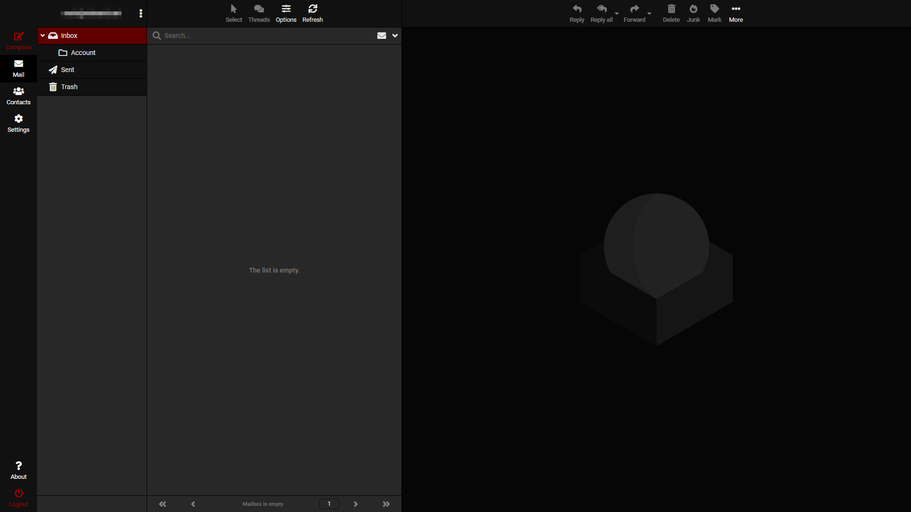

# Elastic-dark

## Introduction 
Dark extension of Roundcube Elastic theme.

## Screenshot
<p align="center"></p>

## Usage
```sh
lessc styles.less styles.css
```
Then put the whole folder under `[Roundcube Path]/skins`

## See also
- lesscss usage: [lesscss.org/usage/](http://lesscss.org/usage/)
